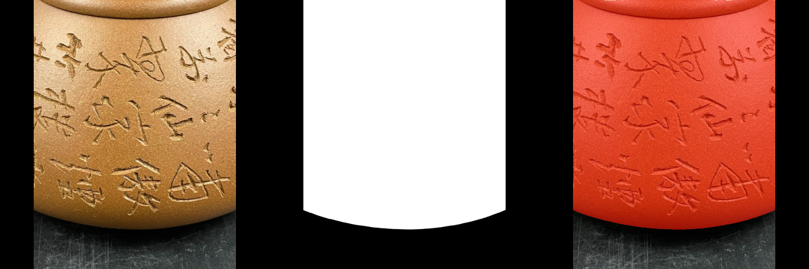
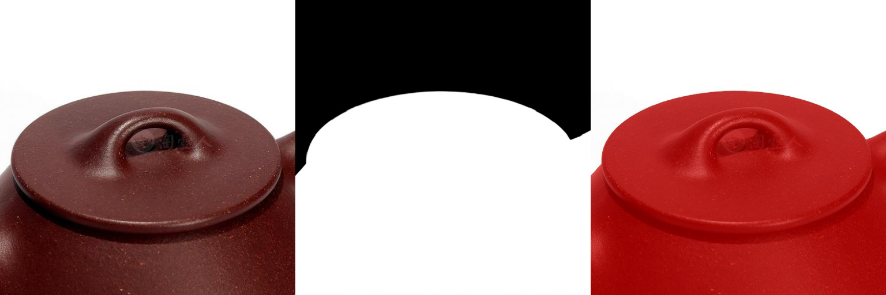
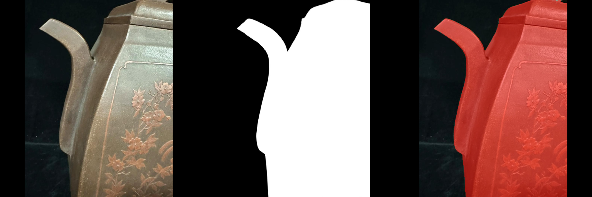
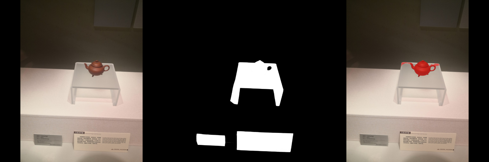
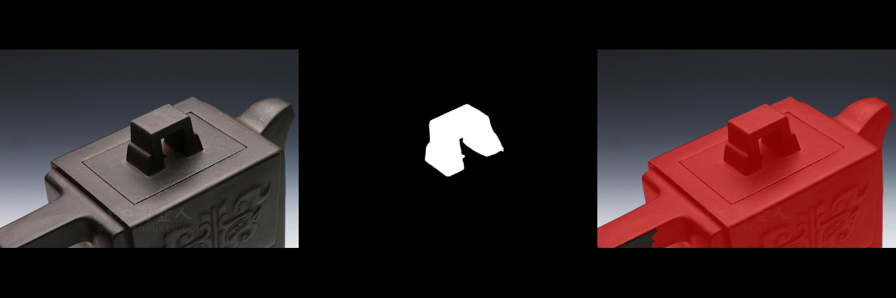
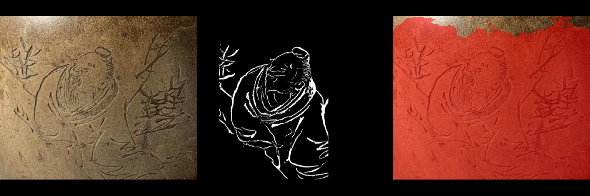
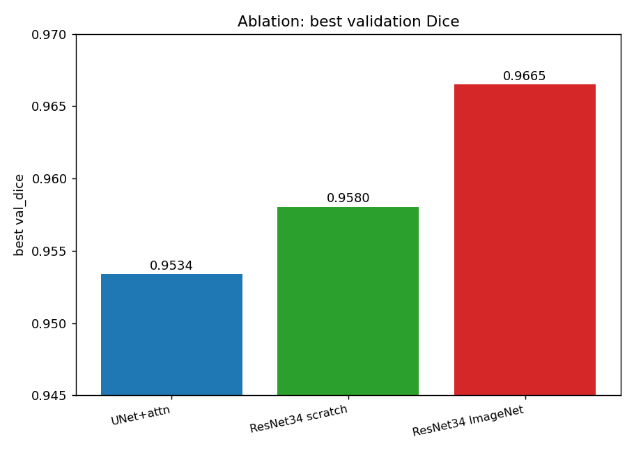
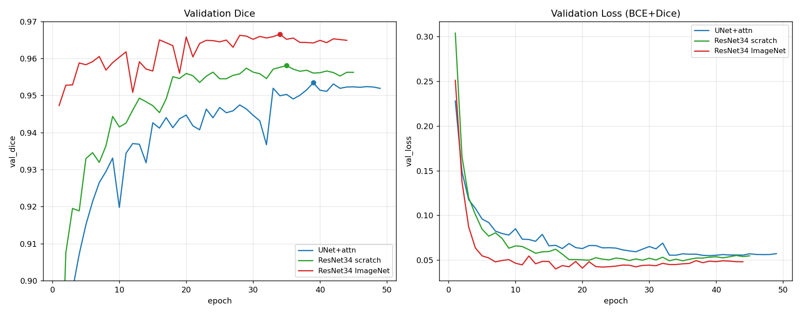

# 紫砂壶图像分割

## 一、框架搭建

本项目基于 PyTorch 实现紫砂壶图像的像素级二元分割，自动定位紫砂壶轮廓。以经典 U-Net 为基线，最终采用 **ResNetUNet**（ResNet34·ImageNet 预训练编码器 + U-Net 解码器 + 注意力门）作为主干网络。整体流程涵盖：

- 数据采集与处理
- 分割模型构建
- AMP 混合精度训练 + AdamW + ReduceLROnPlateau + 早停
- 测试集评估与三联图可视化

## 二、数据准备

1.数据收集

紫砂壶分割任务的训练数据采用 HuggingFace 上的公开数据集 [`AGI-FBHC/ChaHu`]（CN split），共计 9750 张图像。审计后发现原始样本存在以下问题：
- 尺寸不一致：1 张 image 与 mask 尺寸不同
- 前景占比极端：12 张样本前景占比 > 95%
- mask 含抗锯齿软边：9750 张全部带 0–255 渐变像素
- mask 通道格式不统一：`L` / `RGB` / `RGBA` 三种混存
- 图像长宽比跨度大：从 0.44 到 2.49

经清洗后保留 **9737 张有效样本**，按固定种子 (`SEED=42`) 以 7 : 1.5 : 1.5 划分：

| 划分 | 样本数 |
| :-: | :-: |
| Train | 6815 |
| Val | 1460 |
| Test | 1462 |

2.数据增强

一方面，数据集中存在一定的标签噪声，展台、茶壶阴影以及手部区域被误标为茶壶前景；另一方面，由于采集过程中拍摄距离和拍摄角度不同，数据具有明显的尺度变化和视角变化。此外，不同类别茶壶在形状、材质、颜色和纹理等方面存在较大的类内差异，增加了模型学习鲁棒特征的难度。为提升模型对不同视角、光照及尺寸的鲁棒性，进行了如下数据增强：

- 水平翻转：p = 0.5
- 随机旋转：±15°
- 颜色抖动：`ColorJitter(brightness=0.2, contrast=0.2)`
- letterbox 等比缩放 + 对称 0 padding 到 512×512（image 用 BILINEAR，mask 用 NEAREST）
- mask 二值化：阈值 **`≥ 128`**
- ImageNet 均值方差归一化


3.目录结构

```
chahuSegment/
├── configs/                             # 共用的超参与路径配置
├── datasets/                  
│   ├── chahu.py                         # 数据加载
│   └── data_utils.py                    # 数据集审计、train/val/test 划分、letterbox 工具
├── utils/                               # 杂项工具
├── docs/images/             
├── unet.py                              # 模型定义
├── dice_loss.py                         # BCEDiceLoss
├── trainer.py                           # Trainer：训练/验证、早停、LR 调度、AMP、保存模型
├── metrics.py                           # Dice / IoU / Precision / Recall / Pixel Accuracy + 分桶聚合
├── noise_audit.py                       # 标签噪声审计（连通域分析）
├── train.py                             # 训练入口
├── test.py                              # 测试评估入口
├── predict.py                           # 单图 / 批量推理入口
```

## 三、模型设计与训练

1.模型架构

本项目最终采用 **ResNetUNet**（ResNet34·ImageNet 预训练编码器 + U-Net 解码器 + 注意力门）作为主干网络。结构如下：

- 编码器：torchvision `resnet34`（ImageNet 预训练），五级特征分别为 stem 64/2、layer1 64/4、layer2 128/8、layer3 256/16、layer4 512/32
- 解码器：4 个 `DecoderBlock` 逐级双线性上采样 + 与同分辨率跳跃特征拼接 + 双卷积，末端再上采样一次恢复到输入分辨率
- 注意力门：在每个解码块的跳跃连接上生成 0~1 逐像素权重，抑制背景、突出目标
- 跳跃连接：把编码器各级特征拼接到解码器对应层，融合高低层信息以增强边缘分割精度

| **组件** | **参数 / 方法** |
| :-: | :-: |
| 基础模型 | ResNetUNet |
| 编码器权重 | ImageNet 预训练（`ResNet34_Weights.IMAGENET1K_V1`） |
| 输入分辨率 | 512 × 512 |
| 损失函数 | BCE + Dice  |
| 优化器 | **AdamW**（`weight_decay=1e-4`） |
| 初始学习率 | 1e-4 |
| Batch Size | 8 |
| Epoch | 50 |
| 学习率调度 | `ReduceLROnPlateau(mode=max, factor=0.5, patience=3, min_lr=1e-6)` |
| 早停策略 | `patience=10, min_delta=1e-4`（monitor = val_dice） |
| 混合精度 | `torch.cuda.amp` |
| 权重保存策略 | val_dice 最高时保存 `best.pth` |

2.pytorch代码

```python
class DecoderBlock(nn.Module):
    """解码块：双线性上采样 → 可选注意力门 → 与跳跃特征拼接 → 双卷积。"""

    def __init__(self, in_channels, skip_channels, out_channels, attention=False):
        super().__init__()
        self.up = nn.Upsample(scale_factor=2, mode='bilinear', align_corners=True)
        self.attention_gate = (
            AttentionGate(in_channels, skip_channels, max(skip_channels // 2, 1))
            if attention else None
        )
        self.conv = DoubleConv(in_channels + skip_channels, out_channels)

    def forward(self, x, skip):
        x = self.up(x)
        diffY = skip.size()[2] - x.size()[2]
        diffX = skip.size()[3] - x.size()[3]
        x = F.pad(x, [diffX // 2, diffX - diffX // 2,
                      diffY // 2, diffY - diffY // 2])
        if self.attention_gate is not None:
            skip = self.attention_gate(gate=x, skip=skip)
        x = torch.cat([skip, x], dim=1)
        return self.conv(x)


class ResNetUNet(nn.Module):
    """ResNet-34（ImageNet 预训练）编码器 + U-Net 解码器，可选注意力门。"""

    def __init__(self, n_channels=3, n_classes=1, attention=False, pretrained=True):
        super().__init__()
        weights = ResNet34_Weights.IMAGENET1K_V1 if pretrained else None
        backbone = resnet34(weights=weights)
        if n_channels != 3:
            backbone.conv1 = nn.Conv2d(n_channels, 64, kernel_size=7, stride=2, padding=3, bias=False)

        # ---------- 编码器（取自 resnet34） ----------
        self.stem = nn.Sequential(backbone.conv1, backbone.bn1, backbone.relu)  # 64,  /2
        self.pool = backbone.maxpool
        self.layer1 = backbone.layer1  # 64,  /4
        self.layer2 = backbone.layer2  # 128, /8
        self.layer3 = backbone.layer3  # 256, /16
        self.layer4 = backbone.layer4  # 512, /32

        # ---------- 解码器 ----------
        self.dec4 = DecoderBlock(512, 256, 256, attention)  # /16
        self.dec3 = DecoderBlock(256, 128, 128, attention)  # /8
        self.dec2 = DecoderBlock(128, 64, 64, attention)    # /4
        self.dec1 = DecoderBlock(64, 64, 32, attention)     # /2
        self.up0 = nn.Upsample(scale_factor=2, mode='bilinear', align_corners=True)  # /1
        self.outc = OutConv(32, n_classes)

    def forward(self, x):
        e0 = self.stem(x)                 # 64,  /2
        e1 = self.layer1(self.pool(e0))   # 64,  /4
        e2 = self.layer2(e1)              # 128, /8
        e3 = self.layer3(e2)              # 256, /16
        e4 = self.layer4(e3)              # 512, /32
        d4 = self.dec4(e4, e3)            # 256, /16
        d3 = self.dec3(d4, e2)            # 128, /8
        d2 = self.dec2(d3, e1)            # 64,  /4
        d1 = self.dec1(d2, e0)            # 32,  /2
        d0 = self.up0(d1)                 # 32,  /1
        return self.outc(d0)
```


3.训练流程

训练曲线：


观察：
* `train_loss` 从 0.35 → 0.012 持续单调下降。
* `val_loss` 从 0.25 → 最低 0.040（epoch 16），此后回升到 0.044–0.049 并趋平。
* **预训练收敛极快**：`val_dice` 第 1 个 epoch 即达 0.947，epoch 7 到 0.961，**epoch 16 起进入 0.965 平台期**；后续 LR 阶梯下降带来微调收益，epoch 34 达最佳 **0.9665**。


验证阶段：

`ReduceLROnPlateau` 监控 `val_dice`：若连续 3 个 epoch 未改进则学习率减半（实测 LR 从 1e-4 阶梯降为 5e-5 → 2.5e-5 → 1.25e-5 → 6.25e-6 → 3.13e-6）。

早停器同样监控 `val_dice`，连续 10 个 epoch 未改进则终止训练（实测最佳 epoch 34、val_dice = 0.9665，随后于 epoch 44 触发早停）。


## 四、实验结果

分割性能指标（测试集 1462 张）

### 1. 整体指标

| **指标 (Metric)** | **Mean** | **Median** | 基线 U-Net (Mean) |
| :-: | :-: | :-: | :-: |
| **Dice** | **0.9630** | **0.9910** | 0.9453 |
| **IoU (Jaccard)** | 0.9407 | 0.9821 | 0.9111 |
| **Pixel Accuracy** | 0.9869 | 0.9976 | 0.9798 |

相比基线 U-Net，测试集 **Dice 均值 0.9453 → 0.9630**，各项指标全面提升。

### 2. 按阈值达标率

| 阈值 | Dice ≥ |
| --- | --- |
| 0.99 | 55.0% |
| 0.95 | **88.2%** |
| 0.90 | **91.9%** |
| 0.80 | 95.3% |
| 0.50 | 98.8% | 

* **88% 的样本 Dice ≥ 0.95**（基线 76%），**92% 的样本 Dice ≥ 0.90**（基线 85%），高质量分割占比显著提升。
* **硬失败率 1.23%**：Dice < 0.5 的样本 18 / 1462，其中 Dice < 0.3 仅 6 张。

### 3. 效果图

每张按 **原图 | 真值 mask | 预测红色叠加** 拼成三联。

好例（Dice ≈ 1.0）：







错例（Dice 偏低）：







> 观察：错例基本源于**真值标注噪声**——GT 把展台、标签牌等背景误标为前景，而模型只准确分割了茶壶本体，故 Dice 被拉低。


## 六、消融实验

> 本节为在基线 U-Net 之上的改进实验，消融对比**指标均为验证集 (val) 结果**。三组除 encoder 外训练配方完全一致，用于干净拆解「换预训练主干」的增益来源。

### 结果



| 模型| best val_dice | 最佳 epoch | 实跑 epoch |  |
| --- | --- | --- | --- | --- |
| UNet+注意力门 | 0.9534 | 39 | 49 |
| ResNet34 结构·随机初始化 | 0.9580 | 35 | 45 |
| **ResNet34·ImageNet 预训练** | **0.9665** | 34 | 44 |

增益拆解：

| 对比 | 差值 | 含义 |
| --- | --- | --- |
| resnet_scratch − unet_scratch | **+0.0046** | 单纯"换成 ResNet34 结构"的贡献 |
| resnet_pretrained − resnet_scratch | **+0.0085** | 单纯"ImageNet 预训练权重"的贡献 |
| **resnet_pretrained − unet_scratch** | **+0.0131** | **换预训练主干的总收益** |

**结论**：resnet_pretrained 替换 unet_scratch 提升 +0.0131（0.9534→0.9665）。其中 **ImageNet 预训练是主要贡献者**，说明收益主要来自迁移学习，而非单纯网络更深。




**预训练收敛极快**：resnet_pretrained 第 1 个 epoch 就到 0.947、第 7 个 0.961，第 34 epoch 达最佳后早停；val_loss 最低（0.048）。
两个从零训练的组要到 ~epoch 35-39 才摸到各自最佳，且 val_loss 更高（0.055-0.057）。


